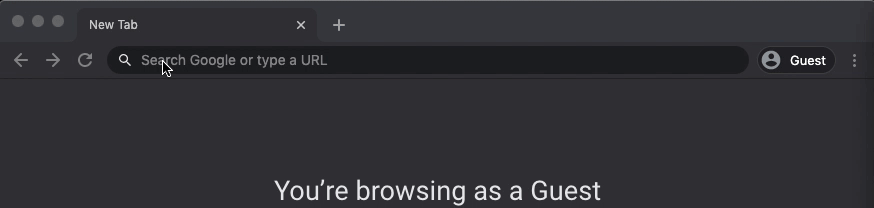
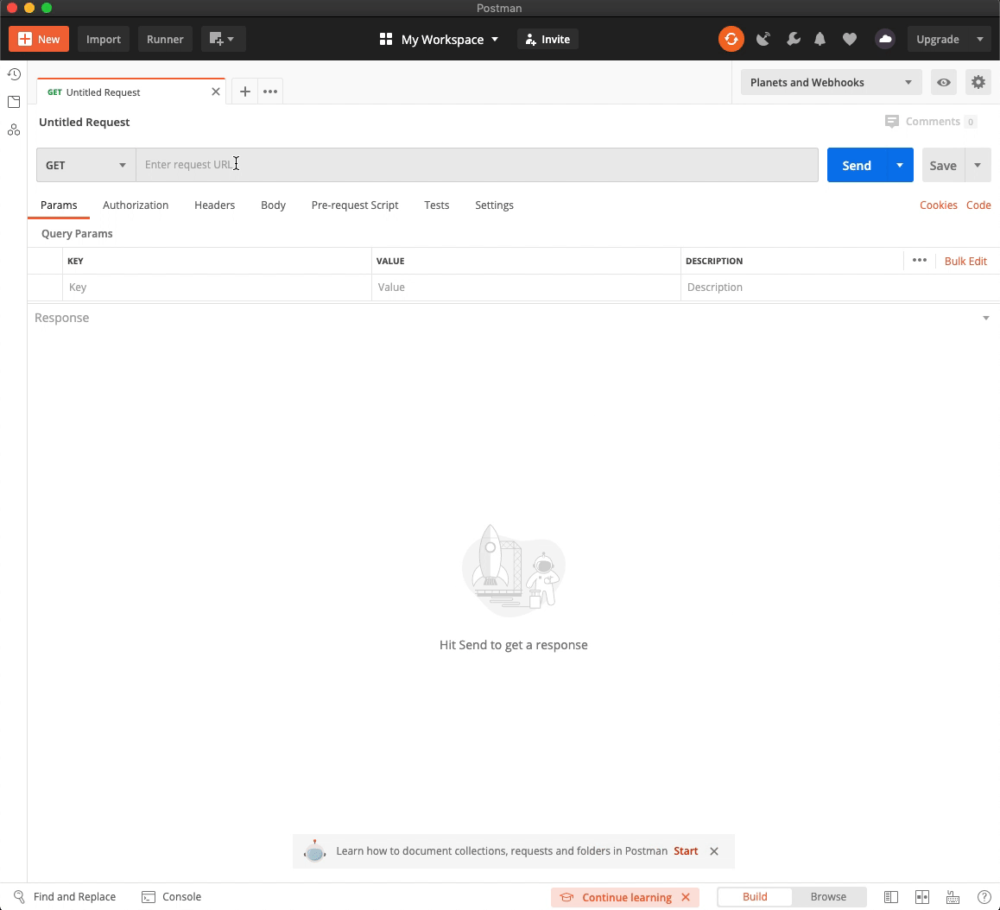

<div align="center">

# Planets And Webhooks

</div>

## 📖 Table of Contents

- [About the Project](#📄-about)
- [Getting Started](#🚀-getting-started)
- [Using Planets and Webhooks](#📟-using-planets-and-webhooks)
- [Contributing](#🤝-contributing)
- [License](#📝-license)

## 🔍 About the Project

Planets and Webhooks is a Python-based sample [Flask](https://flask.palletsprojects.com/en/1.1.x/ "Link to Flask website") app for 2-way APIs.

It serves up data about planets from [NASA data](https://solarsystem.nasa.gov/moons/in-depth/ "Link to NASA") at `/planets` and `/planets/{id}`. It also logs the incoming data it receives to a `/webhook` endpoint.

You can check the reference API specification by opening [index.html](/openapi/index.html) available in this repo.

🏆 Forked from and based on [flask-planets-and-webhooks](https://github.com/lornajane/flask-planets-and-webhooks "Link to the original Planets and Webhooks GitHub project") by [Lorna Jane Mitchell](https://lornajane.net/ "Link to Lorna Jane Mitchell's personal website").

## 🚀 Getting Started

This section explains how to get your sample Planets and Webhooks app up and running and be able to test its 2-way API.

### Prerequisites

These are the tools you need to have installed on your machine for the app to work and to play around with the API:

- Root permissions, to install and configure some tools
- [A GitHub account](https://github.com/join "Link to the GitHub sign up page"), to clone the repository
- [Python 3.8.2](https://www.python.org/downloads/release/python-382/ "Link to the Python 3.8.2 download page") or higher, as the main engine
- [pip](https://pip.pypa.io/en/stable/installing/ "Link to pip install instructions"), which comes pre-installed if you downloaded Python 3.8.2 from the official website
- [venv](https://docs.python.org/3/library/venv.html "Link to venv docs") to create a virtual environment

You also need an HTTP client to check that the app is working properly as well as an API testing tool. We recommend:
  - [HTTPie](https://httpie.org/ "Link to HTTPie"), if you are into CLI HTTP clients  
  - [Postman](https://www.postman.com/ "Link to Postman"), a cool REST API design and testing tool

If you need to switch between multiple Python versions, installing [pyenv](https://github.com/pyenv/pyenv "Link to pyenv") before setting this up may be a good idea.

## 📟 Using Planets and Webhooks

After installing all the necessary tools, it is time to use the app. Here is how.

### Set Up the App

Follow these steps to set up the app.

1. Clone the repository using your preferred method:

 - **SSH**: `git clone git@github.com:ocular-d/flask-planets.git`
 - **HTTPS**: `https://github.com/ocular-d/flask-planets.git`

2. Type `cd flask-planets` to browse to the cloned repository.

3. (Optional) If you were using an unsupported Python version, switch to Python 3.8.2 by typing `pyenv local 382`.

4. Type `make venv` to create the virtual environment and install its dependencies.

  For further information on virtual environments, see the [venv documentation](https://docs.python.org/3/tutorial/venv.html#creating-virtual-environments "Link to venv documentation").

5. Type `source venv/bin/activate` to activate the environment.

6. Type `make run` to start the app. A successful procedure will show:  
```shell
 * Serving Flask app "app.py"
 * Environment: production
   WARNING: This is a development server. Do not use it in a production deployment.
   Use a production WSGI server instead.
 * Debug mode: off
INFO:werkzeug: * Running on http://127.0.0.1:5000/ (Press CTRL+C to quit)
```

### Play with the App

You can try the app using your favourite playground. Some examples are:

- Use your web browser to go to http://127.0.0.1:5000/planets.

  

- Using HTTPie, type `http http://127.0.0.1:5000/planets`.  
  ```shell
  http http://127.0.0.1:5000/planets
  HTTP/1.0 200 OK
  Content-Length: 379
  Content-Type: application/json
  Date: Fri, 24 Jul 2020 07:48:34 GMT
  Server: Werkzeug/1.0.1 Python/3.8.2

  [
      {
          "moons": 0,
          "name": "Mercury",
          "position": 1
      },
      {
          "moons": 0,
          "name": "Venus",
          "position": 2
      },
      {
          "moons": 1,
          "name": "Earth",
          "position": 3
      },
      {
          "moons": 2,
          "name": "Mars",
          "position": 4
      },
      {
          "moons": 79,
          "name": "Jupiter",
          "position": 5
      },
      {
          "moons": 68,
          "name": "Saturn",
          "position": 6
      },
      {
          "moons": 27,
          "name": "Uranus",
          "position": 7
      },
      {
          "moons": 14,
          "name": "Neptune",
          "position": 8
      }
  ]
  ```
- Use postman to send requests to the API.  

  

## 🤝 Contributing

We are a community effort, and everybody is most welcome to participate!

Be it filing bugs, formulating enhancements, creating pull requests, or any other means of contribution, we encourage contributions from everyone.

## 📝 License

Distributed under the [MIT](https://choosealicense.com/licenses/mit/ "Link to license") license.
